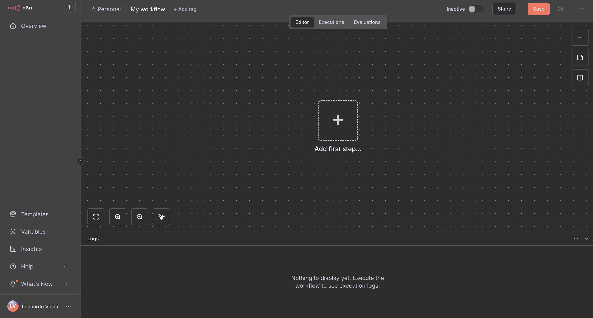
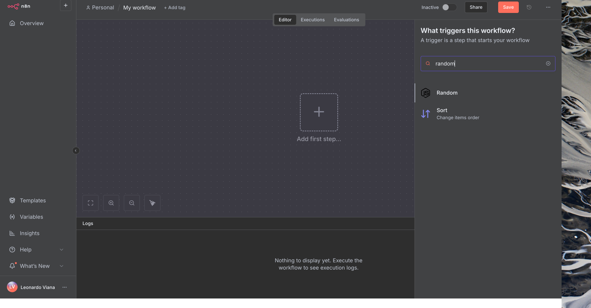
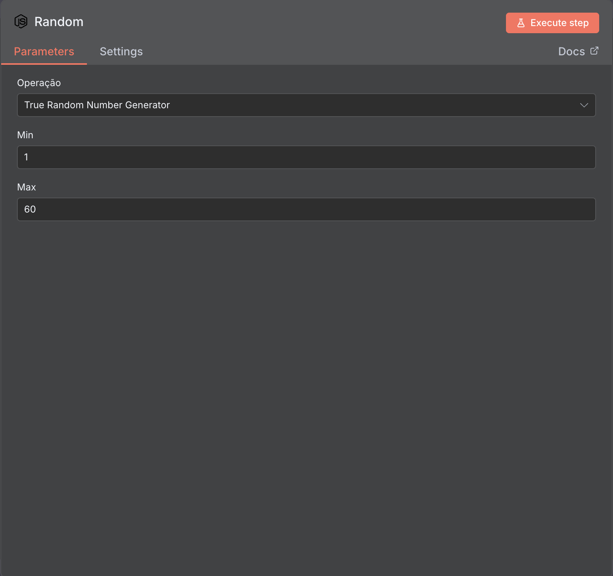
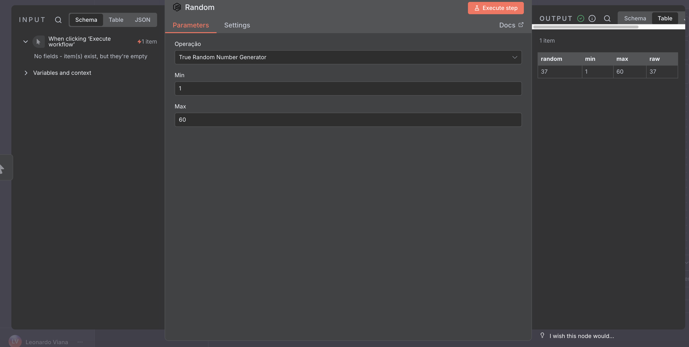
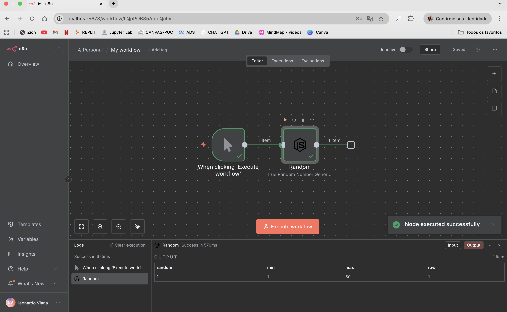

# PROJETO ONFLY


---
## 📂 Estrutura do projeto

```text
📦 ProjetoOnfly
├── 📁 custom_nodes
│   └── 📁 Random
│       ├── 📄 icon.svg
│       ├── 📄 package.json
│       ├── 📄 package-lock.json
│       ├── 📄 random.node.js
│       └── 📄 random.node.ts
├── 📁 imagens
├── 📁 n8n_data
├── ⚙️ tsconfig.json
├── ⚙️ .gitignore
├── 🐳 docker-compose.yml
└── 📘 README.md
````


## 🛠 O que usei?

- n8n (nossa querida plataforma de automação)
- Node.js + TypeScript (para criar o node customizado)
- Docker (porque a vida é mais fácil com containers)
- PostgreSQL (pra guardar os dados do n8n)

## 📋 Antes de começar

Precisa ter instalado em sua maquina:
- **[Node.js](https://nodejs.org/)** (necessário para instalar as dependências do node customizado)
- **[Docker](https://www.docker.com/)** (para rodar o n8n e o PostgreSQL em containers)
- **[Docker Compose](https://docs.docker.com/compose/)** (Já vem junto com o docker desktop)

## 🏃‍♂️ Bora rodar!

1. Primeiro, clona o repo:
```bash
git clone https://github.com/VianaLeo13/ProjetoOnfly.git
cd ProjetoOnfly
```

2. Entrar na pasta
```bash
cd custom_nodes/
cd/Random
```

3. Gerar dependencias:
```bash
npm install
```

4. Rodar o docker:
```bash
docker-compose up -d
```

Se quiser parar o docker:
 ```bash
docker-compose down
```

> 💡 **Dica**: Se mexer no código do node, só rodar `npm run build` na pasta dele e dar um `docker-compose restart n8n`

## 🔑 Acessando

Depois que tudo subir, você pode acessar:

- n8n: http://localhost:5678
- Criar sua conta no n8n
- Entrar na parte de workflow:
- 
- Clicar no "+" no centro:
- Pesquisar pelo node "Random"
- 
- Escolher um numero de minimo e maximo:
- 

- Clicar no botão laranja execute step
- 

## Fluxo:


## 📦 Como o node funciona?

É bem simples! O node se conecta com a API do Random.org pra gerar números verdadeiramente aleatórios. Você só precisa configurar:

- Número mínimo
- Número máximo
- E rodar!
O node cuida de toda a comunicação com a API e validação dos dados.

## 🧪 Testes
- Testei gerando números entre 1 e 100
- Confirmei que o valor retornado está sempre dentro do intervalo
- Node funciona dentro de workflows do n8n


## 🤔 Problemas comuns

- **Node não aparece no n8n?** Reinicia o container que resolve: `docker-compose restart n8n`


